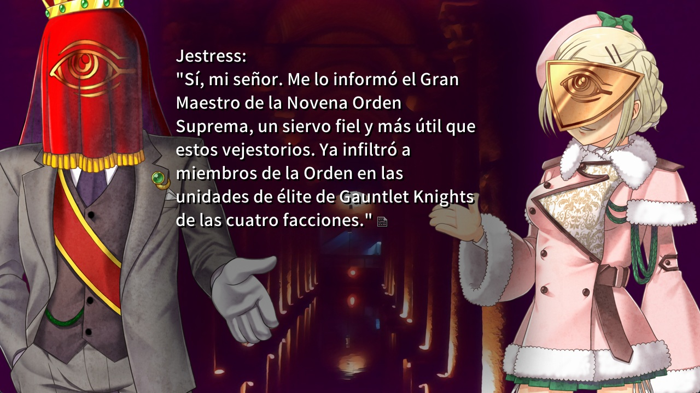

# Ciconia es-419 — Parche de traducción al español

> **🔄 Actualiza si instalaste antes del 13 de junio de 2026.** Las versiones previas a
> esa fecha tenían algunas inconsistencias introducidas por el control de calidad (género,
> términos y comillas), **ya corregidas**. Descarga el instalador más reciente en
> *Releases* y reinstala.

Traducción al **español latinoamericano neutro (es-419)** de *Ciconia no Naku Koro ni*. 
Este repositorio contiene **solo el parche de texto y el instalador**.
No incluye —ni puede incluir— ningún archivo del juego original.

> **Necesitas tu propia copia legal del juego** (Steam, GOG, etc.). El parche se
> aplica sobre ella en tu equipo.



> **Alcance — solo texto (por ahora):** esta versión traduce **únicamente el texto**.
> Las **imágenes** del juego (carteles, texturas con texto, gráficos de la interfaz,
> etc.) se mantienen en su **idioma original**. Es una decisión **temporal**: por ahora
> prefiero no publicar imágenes editadas hasta poder hacerlas con la calidad que
> merecen. Está previsto traducirlas en una actualización futura.

---

## Cómo funciona

El motor del juego (PONScripter) carga un archivo `0.utf` **con prioridad** sobre el
script original `pscript.dat`. Este instalador:

1. **Lee** tu `pscript.dat` (tu copia legal) y lo descifra **en memoria**.
2. Para cada línea de diálogo calcula una **huella SHA-1** y busca su traducción en
   el parche `es_patch.json`.
3. **Genera un archivo nuevo** `0.utf` en español junto al juego.

**No modifica ningún archivo original**: `pscript.dat` queda intacto. El `0.utf`
resultante es una **obra derivada** creada localmente en tu máquina.

Al generar el `0.utf`, el parche además (todo sobre la obra derivada, nunca el original):
- **renombra el título de la ventana** a *“Ciconia When They Cry: Phase 1 - Parche al
  español por Aris Rhiannon”* (puedes desactivarlo con `--no-title`). Se conserva el
  `versionstr` original que acredita a 07th Expansion.
- **estampa la licencia y autoría** como comentarios al final del `0.utf` y en un
  archivo `0.utf.LICENSE.txt` (puedes desactivarlo con `--no-stamp`).

El parche **no contiene texto del juego original**: solo guarda huellas SHA-1
(irreversibles) para localizar las líneas, más la traducción propia en español.
A partir de una huella es imposible reconstruir el texto original.

---

## Instalación fácil — programa con ventana

**No necesitas saber de programación ni instalar Python.**

1. Descarga el archivo **`Instalar-Parche-Ciconia-Phase1.exe`** (sección *Releases*,
   o el que te hayan pasado).
2. **Doble clic** para abrirlo. Se abre una ventana.
   - Windows puede mostrar *“Windows protegió tu PC”* (SmartScreen) porque el programa
     no está firmado digitalmente. Pulsa **“Más información” → “Ejecutar de todas
     formas”**. Es seguro: el código es abierto y no toca los archivos del juego.
3. El programa **busca tu juego solo**. Si no aparece, pulsa **“Buscar…”** y elige la
   carpeta del juego (la que contiene `pscript.dat`).
4. Pulsa el botón verde **“Instalar parche al español”**. ¡Listo!
5. Abre el juego normalmente: el texto estará en español.

¿Quieres volver al idioma original? Abre el programa otra vez y pulsa
**“Restaurar original (desinstalar)”**.

> El programa **no modifica los archivos originales del juego**: crea un archivo de
> traducción (`0.utf`) que el juego carga con prioridad y guarda un respaldo para poder
> revertirlo. Tu `pscript.dat` nunca se toca.

---

## Instalación avanzada 

Requisitos: **Python 3.8+** (no hace falta nada más; usa solo la librería estándar).

```bash
# 1) Clona o descarga este repositorio.
# 2) Desde la carpeta del repo:
python ciconia_patch.py
```

El instalador intenta **detectar** tu instalación de Ciconia (Steam/GOG). Si no la
encuentra, indícala a mano:

```bash
python ciconia_patch.py --game-dir "C:/ruta/al/juego/Ciconia ... Phase 1"
```

Opciones útiles:

| Opción | Para qué |
|---|---|
| `--dry-run` | Simula la instalación sin escribir nada. |
| `--game-dir RUTA` | Indica la carpeta del juego manualmente. |
| `--complete` | Cobertura máxima (rellena líneas idénticas aún no revisadas en contexto). |
| `--no-stamp` | No anexar el aviso de licencia al `0.utf`. |
| `--no-title` | No cambiar el título de la ventana del juego. |
| `--uninstall` | Restaura el `0.utf` previo (o lo elimina). |

### Desinstalar

```bash
python ciconia_patch.py --uninstall --game-dir "C:/ruta/al/juego"
```

Restaura el `0.utf` que hubiera antes (respaldo `0.utf.orig`) o lo elimina para que
el motor vuelva a usar `pscript.dat`. **Tus archivos originales nunca se tocaron.**

---

## Robustez ante versiones y futuras fases

- **Actualizaciones del juego:** las líneas que no cambiaron se siguen traduciendo
  (coinciden por contenido); las que cambiaron quedan en el idioma original, sin
  romper nada. El instalador informa el porcentaje de cobertura.
- **Fases futuras (Ryukishi07 planea 4):** cada fase es un juego con su propio
  `pscript.dat`. El instalador detecta de qué versión/fase se trata por su huella y
  aplica el bundle correspondiente de `patches/`. Para una fase nueva basta añadir
  `patches/phaseN/`.

---

## Estado de la traducción

Consulta `patches/phase1/manifest.json` para ver la cobertura (`coverage_pct`) y la
versión del parche.

---

## Control de calidad (QA)

La traducción pasa por una herramienta de QA propia para verificar su cohesión.
En concreto, el QA se usa para:

- Asistir con la cohesión de términos.
- Identificación de typos y de errores graves de gramática y ortografía.
- Detección de falta de caracteres.
- Detección de errores de código.
- Detección de placeholders sin traducir.

**Aviso:** versiones anteriores del QA introdujeron algunas inconsistencias puntuales
al intentar unificar criterios: en la **concordancia de género** de ciertas líneas y en
la **unificación de algunos términos**. Ya están identificadas y corregidas; aun así,
sigo revisando el texto a fondo por si quedara algún caso residual.

---

## Licencias

Este proyecto usa **doble licencia** según el tipo de material:

| Material | Licencia |
|---|---|
| **Código** (instalador, herramientas, `*.py`) | [AGPL-3.0-or-later](LICENSE) |
| **Texto de la traducción** (segmentos `es` de `es_patch.json`) | [CC BY-NC-SA 4.0](LICENSE.translation) |

Al redistribuir, **conserva los créditos y las licencias**, y distribuye **solo el
parche**, nunca los archivos del juego. Ver [`NOTICE`](NOTICE) para el detalle.

---

## Aviso legal

*Ciconia no Naku Koro ni* y toda su obra original son propiedad de **07th Expansion**.

## Agradecimientos

- **[Lambdadelto](https://www.youtube.com/channel/UCCgK9pgiq0Bt73ESMjQfARg)** — por el apoyo y la colaboración.
- **[23rd District](https://23rddistrict.wordpress.com/)** — referencia invaluable para la comunidad de When They Cry en español.

**Proyecto y Traducción por:** https://x.com/goddamnBern (Aris Rhiannon, ~~GoddamnBernkastel~~)

---

Este es un proyecto de fans **no oficial**, sin afiliación ni respaldo de 07th
Expansion. Una traducción es una obra derivada: el contenido en español es autoría de
este proyecto, pero el uso y la distribución dependen, en última instancia, de los
derechos del titular original. Usa este parche únicamente con una copia legal del juego.

Si eres titular de derechos y tienes alguna objeción, abre un *issue* en el repositorio.

---

## Para desarrolladores

`build_patch.py` (no se distribuye al usuario final) convierte las unidades de
traducción **privadas** (`translation/units/*.json`, que sí contienen el texto
original) en el parche público y limpio:

```bash
python build_patch.py \
  --units-dir "/ruta/translation/units" \
  --meta      "/ruta/translation/source/meta.json" \
  --out-dir   patches/phase1
```

Las unidades privadas se quedan en tu repo privado; aquí solo se publica
`es_patch.json` + `manifest.json`. El resultado del instalador es **byte por byte
idéntico** al del compilador interno del proyecto en la versión para la que se hizo
el parche (verificado por SHA-256).

### Construir el instalador `.exe`

La interfaz gráfica está en `ciconia_patch_gui.py` (solo usa `tkinter`). Para
empaquetarla como **un único ejecutable autónomo** (lleva el parche dentro y no
necesita Python en la máquina del usuario):

```bash
pip install pyinstaller
python build_exe.py            # genera dist/Instalar-Parche-Ciconia-Phase1.exe
python build_exe.py --selftest # además verifica el .exe (sin abrir ventana)
```

El `.exe` y la consola comparten la **misma lógica probada** (`patcher/installer.py`).
El modo oculto `... .exe --selftest` hace una verificación interna **no destructiva**
(instala y restaura sobre una copia temporal del script, comprobando que `pscript.dat`
queda intacto) y escribe el resultado en `%TEMP%\ciconia_gui_selftest.txt`.
